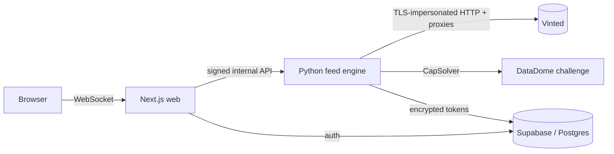

# Blim — Vinted Live Feed & Fastbuy


> A full-stack, self-hostable tool that streams new Vinted listings in **real time**
> and lets you buy a deal in **one click** — built to survive Vinted's anti-bot
> protection. Open-source and educational.

This is the open-source release of a private project. The commercial bits
(payments) have been removed; you bring your own proxies and anti-captcha key.

> ### ⚠️ Prerequisites
>
> This is a **real full-stack tool, not a one-click demo.** To actually run it you need:
>
> - a (free) **Supabase** project — authentication + database
> - your own **proxies** (BYOP) and a **CapSolver** API key — to get past Vinted's anti-bot
> - a **Vinted account** — the feed and fastbuy operate on your own account
>
> Just want to read the code and see how it's built? You don't need any of the above —
> the value here is the engineering, not a click-to-run demo.

---

## What it is

A real-time buyer-side tool for Vinted, in two services:

- **`feed/`** — a Python engine that watches Vinted for new listings, streams them
  to the browser over WebSockets, and can drive an authenticated **fastbuy**
  (checkout + pickup point) on the user's own account.
- **`web/`** — a Next.js app: the live feed UI with Vinted-style filters, account
  linking, and a one-click buy button. Auth via Supabase.

The interesting engineering is the part that makes it **work at all**: staying
authenticated and unblocked against Vinted's **DataDome** anti-bot.

## Architecture



## Features

| | |
| --- | --- |
| 🔴 **Real-time feed** | New listings appear as they're published, pushed over WebSockets |
| 🎯 **Vinted-style filters** | Category, brand, size, price, colour, condition |
| ⚡ **One-click fastbuy** | Pre-warmed checkout: conversation → checkout → pickup → pay |
| 📦 **Automatic pickup** | Picks the cheapest nearby pickup point per carrier, caches it |
| 🔐 **Account linking** | Login + 2FA, tokens stored **encrypted** (Fernet), auto-refreshed |
| 🛡️ **Anti-bot** | curl_cffi TLS impersonation + CapSolver for DataDome + proxy rotation |

## How the hard parts work

- **Staying unblocked.** Requests use `curl_cffi` to impersonate a real Chrome TLS
  fingerprint; DataDome challenges are solved via CapSolver; each account gets a
  dedicated proxy IP. See `feed/session.py`.
- **Session lifecycle.** Login (with 2FA) yields access/refresh tokens that are
  encrypted at rest and refreshed by a background worker with jittered timing to
  look human. See `feed/session_refresh.py`, `feed/refresh_worker.py`.
- **Fastbuy.** The checkout is built ahead of the click so only the final payment
  is on the critical path; the pickup point is chosen by price/distance and cached
  per carrier. See `feed/vinted_api.py`, `feed/pickup_select.py`.

## Tech stack

- **Engine:** Python, FastAPI, `curl_cffi`, `asyncpg`, `cryptography` (Fernet)
- **Web:** Next.js 15 (App Router), React 19, TypeScript, CSS Modules
- **Auth & data:** Supabase (Postgres)
- **Anti-bot:** CapSolver (DataDome), rotating/dedicated proxies (BYOP)
- **Deploy:** Docker Compose (runs locally with one command)

## Quick start (local, Docker)

You need a (free) Supabase project. Proxies + a CapSolver key are only needed for
the actual Vinted actions (feed enrichment / fastbuy), not just to boot the app.

```bash
# 1. Config — copy the two env files and fill them in
cp .env.example .env             # Supabase keys + shared secrets
cp feed/.env.example feed/.env   # proxies, CapSolver, DB + the same shared secrets

# 2. Apply the DB schema (supabase/vinted.sql) in the Supabase SQL editor

# 3. Run
docker compose up --build
```

Then open **http://localhost:3000**.

## Project structure

```
feed/     Python engine — anti-bot session, feed, fastbuy, refresh workers, tests
web/      Next.js app — feed UI, filters, account linking, auth
supabase/ Postgres schema (proxy_pool, vinted_sessions, pickup_prefs, buy_debug)
```

## Disclaimer

Educational / portfolio project. **Not affiliated with, endorsed by, or connected
to Vinted.** Automating a marketplace account carries risk and may conflict with
its Terms of Service — use responsibly, on your own account, at your own risk.
No proxy credentials, API keys, or user data are included in this repository.

## License

MIT — see [LICENSE](LICENSE).
